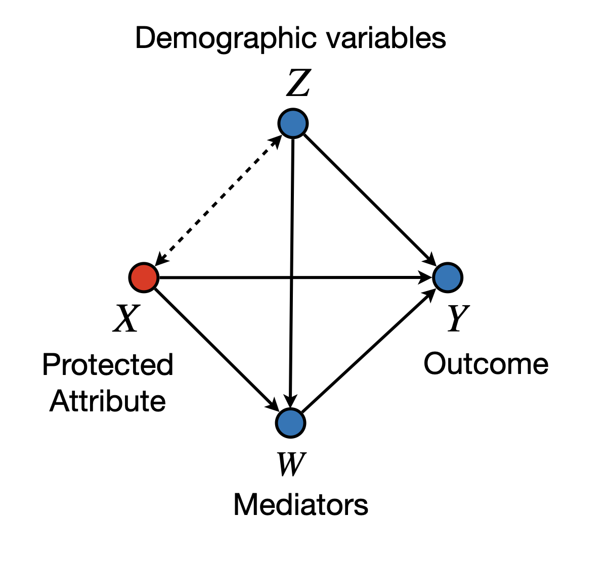

```{r setup, include=FALSE}
knitr::opts_chunk$set(echo = TRUE)
library(ggplot2)
library(latex2exp)
library(scales)
```

## Standard Fairness Model

The framework of Causal Fairness Analysis [@plecko2022causal] introduces the _Standard Fairness Model (SFM)_, which is a type of causal diagram with slightly fewer assumptions than the typically used diagrams in the literature (in particular, SFM is a type of clustered diagram [see @anand:etal21]). In particular, the SFM can be seen in @fig-sfm. 

::: {layout="[[-25, 50, -25]]"}
{#fig-sfm}
:::

We in particular focus on the bidirected arrow between nodes $X$ and $Z$. Such an arrow in particular allows for the possibility that there are variations between $X$ and $Z$ that can be left unexplained in the model, or that unmeasured confounders may exist, or that we are dealing with selection bias. 
Practically speaking, assuming that no bidirected arrows exist is a strong assumption that does not hold in many settings. For instance, consider the widely recognized phenomenon in the fairness literature known as _redlining_ [@zenou2000racial; @hernandez2009redlining]. In some practical settings, the location where loan applicants live may correlate with their race. Applications might be rejected based on the zip code, disproportionately affecting certain minority groups in the real world. 

It has been reported in the literature that correlation between gender and location, or religious and location may possibly exist, and therefore, should be acknowledged through modeling. For instance, the one-child policy affecting mainly urban areas in China had visible effects in terms of shifting the gender ratio towards males [@hesketh2005effect; @ding2006family]. Beyond race or gender, religious segregation is also a recognized phenomenon in some urban areas [@brimicombe2007ethnicity]. Again, while we make no claim that location affects race (or religion), or vice-versa, the bidirected arrows give a degree of modeling flexibility that allows for the encoding of such co-variations. Still, this is without making any commitment to whatever historical processes and other complex dynamics that took place and generated such imbalance in the first place. To corroborate this point, consider the following practical investigation.

A data scientist is trying to understand the correlation between the features in the COMPAS dataset. The protected attribute $X$ is race, and the demographic variables $Z_1$, $Z_2$ are age and sex. The data scientist tests two hypotheses, namely:
\begin{align}
    H^{(1)}_0: X \perp\!\!\!\perp Z_1,\\
    H^{(2)}_0: X \perp\!\!\!\perp Z_2.
\end{align}
To do so, the data scientist first loads the COMPAS dataset from the `faircause` package:
```{r}
data <- get(data("compas", package = "faircause"))
knitr::kable(head(data), caption = "COMPAS dataset.")
```

After loading the data, the data scientist visualizes the correlations of the variables:
```{r}
#| label: fig-compas-ci
#| fig-cap: Association of X and Z sets on the COMPAS dataset.
#| fig-width: 10
#| fig-height: 5
c1 <- ggplot(data, aes(x = age, fill = race)) +
  geom_density(alpha = 0.4) + theme_bw() +
  theme(
    legend.position = c(0.8, 0.8),
    legend.box.background = element_rect()
  ) + ggtitle(TeX("COMPAS: age $\\perp$ race rejected (p < 0.001)"))

c2 <- ggplot(data, aes(x = race, fill = sex)) +
  geom_bar(position = "fill") +
  geom_text(
    aes(label = percent(round(after_stat(count)/tapply(after_stat(count), after_stat(x), sum)[after_stat(x)], 4))),
            stat = "count", position = position_fill(0.5)
  ) +
  scale_y_continuous(labels = percent) + ylab("proportion") +
  theme_minimal() + ggtitle(TeX("COMPAS: race $\\perp$ sex rejected (p < 0.001)"))

cowplot::plot_grid(c1, c2, ncol = 2L)
```

@fig-compas-ci shows the association of $X$ and $Z_1$, $Z_2$. For testing the independence hypothesis $H_0$, the data scientist runs:
```{r}
wilcox.test(data[data$race == "White", ]$age, data[data$race == "Non-White", ]$age)
```
In fact, both of the hypotheses are rejected ($p$-values $< 0.001$). However, possible confounders of this relationship are not measured in the corresponding dataset.

Similarly, the same data scientist is now trying to understand the correlation of the features in the Government Census dataset (we skip the code to avoid repetition). The protected attribute $X$ is gender, and the demographic variables $Z_1$, $Z_2$ are age and race. The data scientist tests the independence of sex and age ($X \perp\!\!\!\perp Z_1$), and sex and race ($X \perp\!\!\!\perp Z_2$), and both hypotheses are rejected (p-values $< 0.001$). @fig-adult-ci shows the associations of the features. Again, possible confounders of this relationship are not measured in the corresponding dataset, meaning that the attribute $X$ cannot be separated from the confounders $Z_1, Z_2$ using any of the observed variables.

```{r}
#| label: fig-adult-ci
#| fig-cap: Association of X and Z sets on the UCI Adult dataset.
#| fig-width: 10
#| fig-height: 5

data <- get(data("gov_census", package = "faircause"))
data <- as.data.frame(data[seq_len(20000), ])

levels(data$race) <- c("Minority", "Minority", "Minority", "Minority", 
                       "Minority", "Minority", "Majority")

wilcox.test(data[data$sex == "female", ]$age, data[data$sex == "male", ]$age)

a1 <- ggplot(data, aes(x = age, fill = sex)) +
  geom_density(alpha = 0.4) + theme_bw() +
  theme(
    legend.position = c(0.2, 0.8),
    legend.box.background = element_rect()
  ) + ggtitle(TeX("Adult: age $\\perp$ sex rejected (p < 0.001)"))

a2 <- ggplot(data, aes(x = sex, fill = race)) +
  geom_bar(position = "fill") +
  geom_text(aes(label = percent(round(after_stat(count)/tapply(after_stat(count), after_stat(x), sum)[after_stat(x)], 4))),
            stat = "count", position = position_fill(0.5)) +
  scale_y_continuous(labels = percent) + ylab("proportion") +
  theme_minimal() + ggtitle(TeX("Census: race $\\perp$ sex rejected (p < 0.001)"))

cowplot::plot_grid(a1, a2, ncol = 2L)
```
