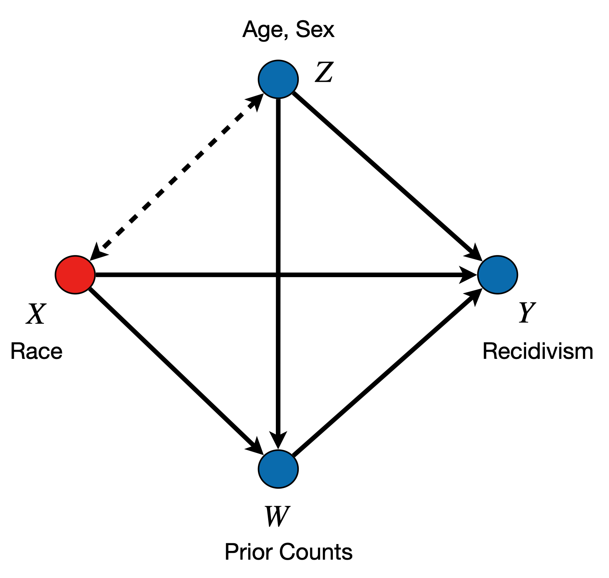
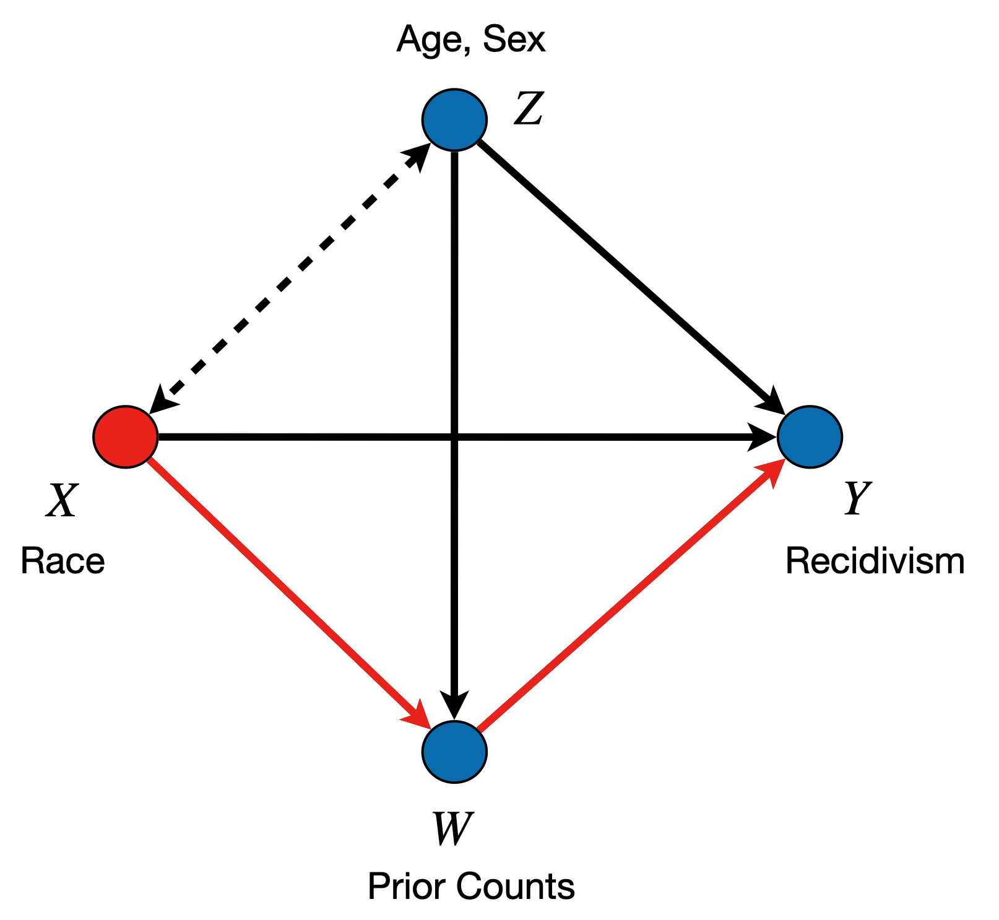
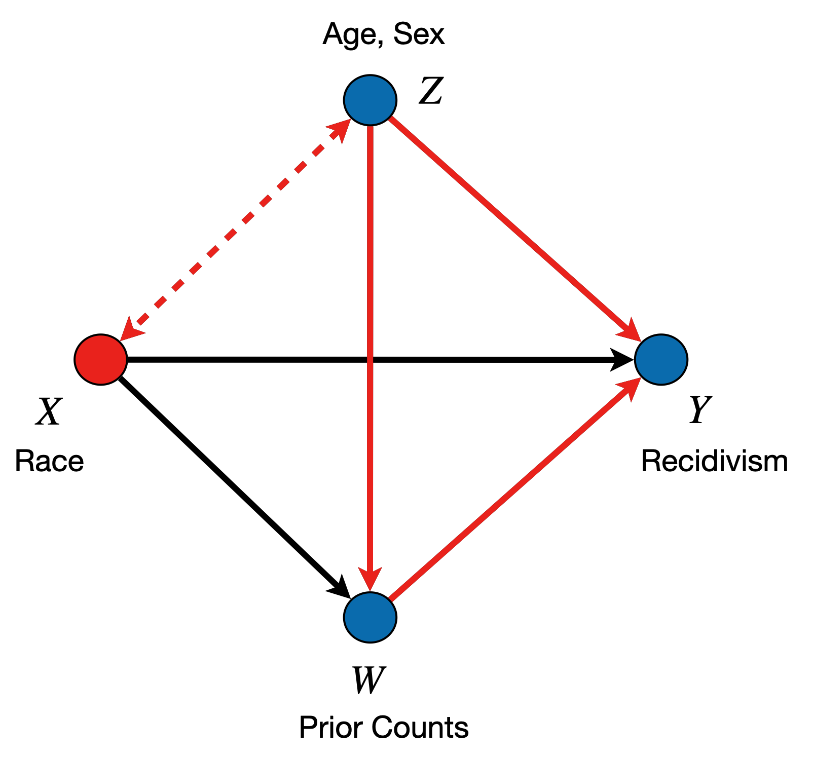

```{r, setup, include = FALSE}
knitr::opts_chunk$set(echo = TRUE)

library(faircause)
library(ggplot2)
library(ranger)
library(latex2exp)

set.seed(2022)

root <- rprojroot::find_root(rprojroot::is_git_root)
data <- read.csv(file.path(root, "inst", "extdata", 
                           "compas-scores-two-years.csv"))
col.keep <- which(
  names(data) %in% c("age", "sex", "juv_fel_count",
                     "juv_misd_count", "juv_other_count", "priors_count",
                     "c_charge_degree", "race", "two_year_recid", "decile_score")
)
data <- data[, col.keep]
data$race <- factor(data$race)
levels(data$race) <- c("Minority", "Minority", "Majority", "Minority",
                       "Minority", "Minority")
data$race <- relevel(data$race, "Majority")
cumsum(table(data$decile_score)) / sum(table(data$decile_score))
# decile_score > 4 represents high risk (approximately)
data$northpointe <- as.integer(data$decile_score > 4)
data$decile_score <- NULL
names(data) <- gsub("_count", "", names(data))
names(data)[which(names(data) == "c_charge_degree")] <- "charge"
```

# Introduction

Across United States, courts are using algorithms to predict which of the defendants are likely to recidivate and re-offend. As is becoming apparent in the literature on fair machine learning, algorithms do not have any ethical or moral values a priori, and they are capable of learning, or even amplifying the existing societal bias. If left unattended, such algorithms could lead to the perpetuation of unfairness, raising a serious concern about the impact of AI on socially important questions in the long term.

In their seminal work from 2016 [@larson2016recidivism], the team from ProPublica (an independent, non-profit newsroom), analyzed data from a commercial tool called Correctional Offender Management Profiling for Alternative Sanctions (COMPAS), which was developed by Northpointe, Inc. (the company is today known as Equivant). The analysis was performed on a large number of individuals from Broward County, Florida, and compared the recidivism predictions produced by COMPAS with those that actually occurred in practice. The findings of their analysis sent alarm bells ringing to everyone concerned about issues of racial injustice. In particular, the ProPublica team demonstrated, among other things, that:

  - black defendants who did not recidivate over a two-year period were nearly twice as likely to be classified as higher risk compared to their white counterparts,
  - white defendants who did recidivate over a two-year period were labeled as low risk twice as often as black re-offenders.

The above mentioned disparities observed by ProPublica are a starting point of an important investigation. What their analysis did not investigate is the _causal explanation_ of how the disparities arose. In particular, using the language of causal models, we provide such an explanation as follows. For the observed disparity between the groups, we quantify how much of the disparity can be explained by:

  a. the direct causal effect of race on the outcome (not explained by other features),
  a. the indirect causal effect of race on previous offenses and degree of charge, which in turn influence the outcome,
  a. the confounded effect of race, which is associated with age and sex in the dataset, both of which are predictive of outcome.

We remark here that our causal analysis should be thought of manipulating the ``signals" of race, or its perception, rather than race itself, which is an immutable characteristic of every individual [@weinberger2022signal;@greiner2011causal]. 

The three steps of our analysis are the following:
  A.  we first look at the causal explanation of the two-year recidivism rates $Y$, which will help us understand the causal effects of race in the real world,
  A. we then look at the causal explanation of the Northpointe's predictions, which will help us understand the causal effects of the _predicted world_,
  A. finally, we look at the causal explanation of the Northpointe's predictions when subsetting to only the group of individuals who did not recidivate over a two-year period; such an analysis will help us understand how Northpointe's predictions causally treat individuals who do not re-offend.

We now introduce the methodology used in our analysis, which is implemented in the `faircause` R-package. The package can be installed using:

```{r install, eval=FALSE}
devtools::install_github("dplecko/CFA")
```

# Methodology

In this manuscript, we analyze the same dataset as the ProPublica team. We apply tools of causal reasoning [@pearl:2k]. In particular, we follow the approach of Causal Fairness Analysis described in [@plecko2022causal]. First, we start by constructing a causal graphical model of the dataset. The dataset consists of the following information:

  - the protected attribute $X$, in this case race (for simplicity, race has two levels, corresponding to the majority group, and all other minority groups put together),
  - the confounding variables $Z$, in this case age and sex,
  - the mediator variables $W$, in this case juvenile and prior offense counts, and the degree of criminal charge,
  - two outcome variables, $Y$ and $\hat{Y}$, which represent the two-year recidivism and the Northpointe's prediction, respectively. 
  
Therefore, our dataset looks like:
```{r, echo=FALSE}
knitr::kable(head(data), caption = "COMPAS dataset")
```

The causal diagram of the above dataset is shown in @fig-compas-sfm, which shows how different variables influence each other. The causal graphical model can be interpreted as follows:

  - there is a bidirected edge between race $X$ and demographic variables $Z$, which are correlated in the dataset; the edge represents either a confounding mechanism through some historical context, or a selection bias mechanism,
  - there is a directed edge from $X$ to $W$, $Y$, which allows for the possibility that race has an effect on the prior offense counts, and the recidivism outcome; the edge can represent various types of bias, such as a bias in policing or the judicial system against minority groups. 
  - there are directed edges, from $Z, W$ into the outcome $Y$, allowing for the possibility that prior offense counts or demographic features influence recidivism,
  - there is a directed edge from $Z$ to $W$, which represents the effect of demographic variables on prior offense counts.

::: {layout="[[1,1], [1, 1]]"}
{#fig-compas-sfm}

{#fig-dir-effect}

{#fig-indir-effect}

{#fig-conf-effect}
:::
  
Based on the graphical model, and using the methodology of decomposing variations which is introduced in @eq-decomposing shortly, we can decompose the _parity gap_ between the majority and minority groups, into its direct, indirect, and confounded parts. The parity gap is defined as the difference in conditional expectations between the groups, namely

$$
\begin{equation} 
  \text{PG}_{x_0, x_1}(y) = P(Y = 1\mid X = x_1) - P(Y = 1 \mid X = x_0).
\end{equation}
$$ {#eq-decomposing}


From a causal viewpoint, we can decompose the parity gap in the following way:
$$
\begin{equation}
  \text{PG}_{x_0, x_1}(y) = \underbrace{\text{DE}}_{\text{race effect}} +  \underbrace{\text{IE}}_{\text{prior counts effect}} +  \underbrace{\text{CE}}_{\text{age/sex effect}},
\end{equation}
$$
where DE, IE, and CE stand for direct, indirect, and confounded effects, respectively. The graphical visualizations of the thre effects are shown in @fig-dir-effect, @fig-indir-effect, and @fig-conf-effect, respectively. After decomposing the parity gap for two-year recidivism $Y$ (Experiment A), we also decompose it for the Northpointe's predictions $\hat{Y}$ (Experiment B), and finally decompose it for the $\hat{Y}$ in the subgroup of individuals who did not recidivate, i.e. with $Y = 0$ (Experiment C). 

# Results
In this section, we report the results of the three experiments: A) explaining the disparity in true recidivism; B) explaining disparity in Northpointe's predictions; C) explaining disparity in Northpointe's prediction for defendants who did not recidivate ($Y = 0$).

## A: Explaining disparity in recidivism

As our starting point, we first compute the disparity between groups in two-year recidivism:
```{r disparity}
tapply(data$two_year_recid, data$race, mean)
```
Based on this information, we can compute that:
\begin{equation}
  \text{PG}_{x_0, x_1}(y) = 48\% - 39.5\% = 8.5\%.
\end{equation}
We then apply the `fairness_cookbook()` functionality from the \texttt{faircause} R-package, and choose `two_year_recid` ($Y$) as the outcome of interest:

```{r, recid-cookbook, cache=TRUE}
X <- "race"
Z <- c("age", "sex")
W <- c("juv_fel", "juv_misd", "juv_other", "priors", "charge")
Y <- c("two_year_recid")
two_year <- fairness_cookbook(data, X = X, W = W, Z = Z, Y = Y, 
                              x0 = "Majority", x1 = "Minority")
two_year
```

After performing the decomposition we can visualize how the decomposition, as shown in @fig-vis-recid.
```{r, vis-recid, fig.width = 9, fig.height = 6, fig.cap = "Causal decomposition of the parity gap for two-year recidivism.", fig.align='center', out.width = "65%", echo=FALSE}
#| label: fig-vis-recid
autoplot(two_year, decompose = "xspec", signed = FALSE)
```


<!-- The key findings can be summarized in the following table: -->

<!-- | Effect  | Contribution  | Visualization  | -->
<!-- |:---|:---:|:---:| -->
<!-- | **Direct**: the difference in recidivism rate purely due to race is not significantly different from 0  | Explains 1.5% ($\pm$ 1.8%) of the disparity  |  {width=80%} | -->
<!-- | **Indirect**: difference in recidivism rate due to racial disparity in prior counts   | Explains 4% ($\pm$ 0.8%) of the disparity  |  {width=80%} | -->
<!-- | **Confounded**: difference in recidivism rate due to correlation of gender with age/nationality, and influence of age/nationality on decision  | Explains 3% ($\pm$ 1.4%) of the disparity  |  {width=80%} | -->
<!-- | **Total** | 1.5% + 4% + 3% = 8.5% | | -->

Therefore, we have the first crucial result:
$$
\begin{equation}
  \text{PG}_{x_0, x_1}(y) = \underbrace{1.5\%\;(\pm 1.8\%)}_{\text{race effect}} +  \underbrace{4\%\;(\pm 0.8\%)}_{\text{prior counts effect}} +  \underbrace{3\%\;(\pm 1.4\%)}_{\text{age/sex effect}}.
\end{equation}
$$
Important to note is that _race does not have a statistically significant direct effect on outcome_.

## B: Explaining disparity in Northpointe's recidivism predictions

Our next step is to analyze the causal decomposition of the Northpointe's predictions.
```{r disparity-northpointe}
tapply(data$northpointe, data$race, mean)
```
Therefore, we can compute that:
$$
\begin{equation}
  \text{PG}_{x_0, x_1}(\hat{y}) = 52\% - 35\% = 17\%.
\end{equation}
$$
Firstly, we notice that the disparity in the predicted outcome is larger than in the true outcome. But crucially, the question is how this disparity in predicted outcome arises from a causal point of view. We again apply the `fairness_cookbook()`, this time choosing `northpointe` ($\hat{Y}$) as the outcome of interest:
```{r, north-cookbook, fig.width = 9, fig.height = 6, fig.cap = "Causal decomposition of the parity gap for Northpointe's recidivism prediction.", fig.align='center', cache=TRUE, out.width = "65%"}
#| label: fig-north-cookbook
Yhat <- "northpointe"
north_decompose <- fairness_cookbook(data, X = X, W = W, Z = Z, Y = Yhat, 
                                     x0 = "Majority", x1 = "Minority")
autoplot(north_decompose, decompose = "xspec", signed = FALSE) +
  ggtitle(TeX("$PG_{x_0, x_1}(\\hat{y})$ decomposition"))
```

In particular, we obtain that:
$$
\begin{equation}
  \text{PG}_{x_0, x_1}(\hat{y}) = \underbrace{5.5\% \;(\pm 1.75\%)}_{\text{race effect}} +  \underbrace{7.5\% \;(\pm 1.2\%)}_{\text{prior counts effect}} +  \underbrace{3\%\;(\pm 1.5\%)}_{\text{age/sex effect}}.
\end{equation}
$$
The decomposition is also visualized in @fig-north-cookbook. Crucially, we find that _race does have a statistically significant direct effect on Northpointe's predictions_. Furthermore, race by itself explains _one third of the observed disparity_.

## C: Explaining disparity in Northpointe's recidivism predictions for _those who did not recidivate_ 

In the final step, we again perform a decomposition of a disparity, but this time within the group of individuals who did not recidivate. Similarly as before, we can distinguish the direct, indirect, and spurious effects in this disparity. However, the quantity we are decomposing is not the parity gap, but the __error rate__ related to the equality of opportunity criterion, i.e.,
$$
\begin{equation}
\text{ER}_{x_0, x_1}(\hat{y} | y = 0) = P(\hat{Y} = 1 \mid X = x_1, Y = 0) - P(\hat{Y} = 1 \mid X = x_0, Y = 0).
\end{equation}
$$
In words, we compare the proportion of minority individuals who are flagged as high risk, but did not recidivate, to the proportion of majority individuals who are flagged as high risk but did not recidivate. We can compute this as:
```{r, no-recid}
no_recid <- data$two_year_recid == 0
tapply(data$northpointe[no_recid], data$race[no_recid], mean)
```
Therefore, we obtained that:
$$
\begin{equation}
\text{ER}_{x_0, x_1}(\hat{y} \mid y = 0) = 38\% - 23\% = 15\%.
\end{equation}
$$
In words, from defendants who do no recidivate, the minority group defendants are 15% more likely to be labeled as high risk. Once again, we can obtain a causal decomposition, but this time of the $\text{ER}_{x_0, x_1}(\hat{y} \mid y = 0)$ measures. For this purpose, we use the `fairness_cookbook_eo()` functionality:

```{r, eo-decomp, fig.cap = "Causal decomposition of the error rate for the group of non-recidivists.", fig.align='center', fig.width = 9, fig.height = 6, cache=TRUE, out.width = "65%"}
#| label: fig-eo-decomp
eo_decompose <- fairness_cookbook_eo(data, X = X, W = W, Z = Z, Y = Y,
                            Yhat = Yhat, x0 = "Majority", x1 = "Minority",
                            ylvl = 0)
autoplot(eo_decompose, decompose = "xspec", signed = FALSE, eo = TRUE)
```

The visualization of the decomposition is shown in @fig-eo-decomp and can be written mathematically as:
\begin{equation}
  \text{ER}_{x_0, x_1}(\hat{y} \mid y = 0) = \underbrace{6.8\% \;(\pm 2\%)}_{\text{race effect}} +  \underbrace{5\% \;(\pm 1.3\%)}_{\text{prior counts effect}} +  \underbrace{3\%\;(\pm 2\%)}_{\text{age/sex effect}}.
\end{equation}
We conclude that _there is a direct effect of race on the prediction even within the group of individuals who do not recedivate_. Race explains _more than one third of the observed disparity_ in the group. 

# Discussion

## Key Findings
The analysis presented in this submission consists of three steps, with each of the steps demonstrating a specific causal explanation. 
The first step of the analysis demonstrates that the direct effect of race is not statistically significant when analyzing the true recidivism rates. In stark contrast, the second analysis shows that for the predictions produced by Northpointe, the direct effect of race is statistically significant, explaining almost a third of the overall racial disparity. Finally, in the third analysis, we show that the direct effect of race on Northpointe's predictions was significant even in the group of individuals who did not re-offend.

Therefore, the absence of the direct effect in the true, observed outcome, and its presence in the predictions for both the overall dataset and the group of non-recidivists, indicates that the predictions produced by Northpointe are strongly racially prejudiced, and constitute a serious mistreatment of the racial minority groups.

## Legal Implications

We quickly discuss some of the possible legal implications of the findings summarized above. Firstly, direct discrimination is explicitly considered in some provisions of the US legal system. For example, under the Title VII of the Civil Rights Act of 1964 [@act1964civil], disparate treatment of individuals based on race is strictly prohibited. Another example is the Fair Housing Act [@housing1968fair], which also prohibits direct racial discrimination.

Interestingly, recent works in legal scholarship have started to turn to interpreting the disparate treatment doctrine in causal language [@plecko2022causal], in particular looking at the direct effect of the protected attribute. The analysis proposed in this work also gives a causal explanation of how the overall disparity came about, and follows from a more broad framework for causal fairness analysis, which was designed with the intention of interpreting the legal doctrines of disparate treatment and disparate impact.

However, the doctrines of disparate treatment and disparate impact would likely not be explicitly considered in a legal proceeding on the COMPAS tool. Nonetheless, the absence of a direct effect of race on the true observed outcome (Experiment A) and its presence in Northpointe's predictions (Experiments B, C) indicate a clear issue and provide prima facie evidence of intentional racial discrimination, which is prohibited by the Equal Protection clause of the 14th Amendment of the United States Constitution.

In conclusion, our causal analysis of the COMPAS tool explains the disparities observed in the data, and demonstrates a clear direct effect of race on predictions of recidivism. As discussed above, such findings likely constitute a basis for legal action against a discriminatory practice from the software provider that produced the predictions.
